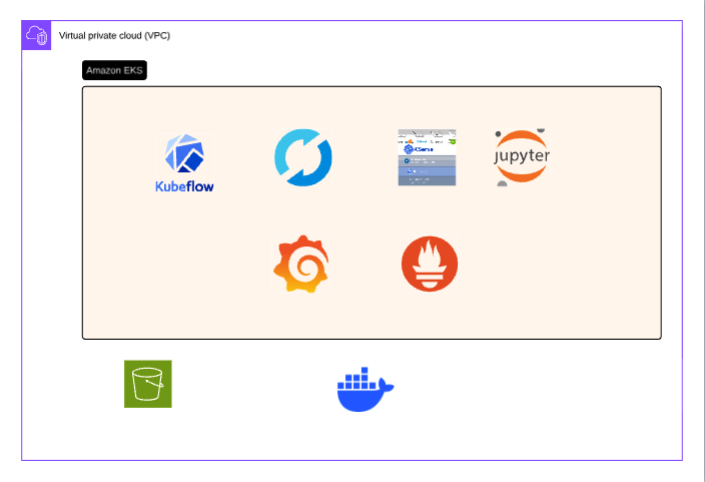

# Credit Card Fraud Detection — End-to-End MLOps Platform on AWS EKS

A production-grade, fully automated MLOps platform for real-time credit card fraud detection. The system covers the complete machine learning lifecycle — from raw data and exploratory analysis through automated training, hyperparameter tuning, model evaluation, versioned registration, canary deployment, live serving, and continuous observability — all running on AWS EKS and accessible through a single unified web dashboard.

---

## Table of Contents

- [What This System Does](#what-this-system-does)
- [Architecture Overview](#architecture-overview)
- [The Problem: Credit Card Fraud Detection](#the-problem-credit-card-fraud-detection)
- [The Dataset](#the-dataset)
- [The Machine Learning Model](#the-machine-learning-model)
- [Automated Training Pipeline](#automated-training-pipeline)
- [Model Registry and Versioning](#model-registry-and-versioning)
- [Real-Time Serving](#real-time-serving)
- [The User Interface](#the-user-interface)
- [Infrastructure on AWS EKS](#infrastructure-on-aws-eks)
- [Unified Dashboard Experience](#unified-dashboard-experience)
- [Observability and Monitoring](#observability-and-monitoring)
- [How the Daily Cycle Works](#how-the-daily-cycle-works)
- [Repository Layout](#repository-layout)
- [Key Design Decisions](#key-design-decisions)
- [Terraform Variables Reference](#terraform-variables-reference)

---

## What This System Does

This platform automates everything that happens after a data scientist finishes exploratory analysis. Once the data is in S3 and the pipeline is scheduled, the system trains a fraud detection model every day at 02:00 UTC without any human intervention. Each training run tunes hyperparameters, trains the model, checks whether it meets a minimum quality bar, logs all results to MLflow, registers the model version, and then deploys it live using a canary strategy — automatically rolling back if the new pod fails to become ready. A data scientist can open a browser, visit the Kubeflow dashboard, watch the pipeline run step by step, compare this run to yesterday's, and see real-time predictions flowing into Grafana dashboards.

Everything runs behind a single AWS Elastic Load Balancer. There are no separate URLs to remember for pipelines, notebooks, model management, or serving. One NGINX ingress controller routes all traffic by path prefix.

---

## Architecture Overview

```
┌──────────────────────────────────────────────────────────────────────────────────┐
│                                 AWS EKS Cluster                                  │
│                                                                                  │
│  ┌──────────────────────────────────────────────────────────────────────────┐    │
│  │               NGINX Ingress  (single LoadBalancer entry point)           │    │
│  │                                                                          │    │
│  │   /                   → Kubeflow Central Dashboard                       │    │
│  │   /pipeline/          → Kubeflow Pipelines UI                            │    │
│  │   /jupyter/           → Kubeflow Jupyter Web App                         │    │
│  │   /kserve-endpoints/  → KServe Models Web App                            │    │
│  │   /notebook/{ns}/{name}/  → Individual notebook proxy                    │    │
│  │   /fraud-detector/    → Fraud detection serving UI + API                 │    │
│  │   /predict            → Inference endpoint (direct)                      │    │
│  └──────────────────────────────────────────────────────────────────────────┘    │
│                                                                                  │
│  ┌─────────────────────────────────────────┐  ┌───────────────────────────────┐  │
│  │     Kubeflow (namespace: kubeflow)      │  │  Serving (namespace: user)    │  │
│  │                                         │  │                               │  │
│  │  Central Dashboard  Profiles Controller │  │  KServe InferenceService      │  │
│  │  Pipelines UI       KServe Controller   │  │  fraud-detector (FastAPI)     │  │
│  │  Notebook Proxy     Admission Webhook   │  │  1–10 replicas, autoscaling   │  │
│  │  Jupyter Web App    Notebook Controller │  │                               │  │
│  └─────────────────────────────────────────┘  └───────────────────────────────┘  │
│                                                                                  │
│  ┌─────────────────────────────────────────────────────────────────────────┐     │
│  │                     Kubeflow Pipelines DAG                              │     │
│  │                                                                         │     │
│  │   Tune → Train → Evaluate ──(fail)──▶ [stop]                            │     │
│  │                     │                                                   │     │
│  │                  (pass)                                                 │     │
│  │                     ▼                                                   │     │
│  │              MLflow Evaluate → Register (@staging)                      │     │
│  │                                      │                                  │     │
│  │                               Canary Deploy                             │     │
│  │                              /           \                              │     │
│  │                         ready           timeout                         │     │
│  │                           │               │                             │     │
│  │                    @production       revert + delete                    │     │
│  └─────────────────────────────────────────────────────────────────────────┘     │
│                                                                                  │
│  ┌────────────────────┐  ┌──────────────────────┐  ┌──────────────────────────┐  │
│  │       MLflow       │  │   JupyterHub / Kale  │  │  Prometheus + Grafana    │  │
│  │  Tracking Server   │  │  Native auth, Kale   │  │  7-panel fraud dashboard │  │
│  │  Model Registry    │  │  for notebook→KFP    │  │  ServiceMonitor 15s      │  │
│  │  S3 artifacts      │  └──────────────────────┘  └──────────────────────────┘  │
│  └────────────────────┘                                                          │
│                                                                                  │
│  ┌──────────────────────────────────────────────────────────────────────────┐    │
│  │                             AWS Services                                 │    │
│  │   S3 (model artifacts + training data)    EBS CSI (persistent volumes)   │    │
│  │   IAM / IRSA (pod-level S3 access)        EKS Managed Node Groups        │    │
│  │   cert-manager (KServe webhook TLS)       VPC with public+private nets   │    │
│  └──────────────────────────────────────────────────────────────────────────┘    │
└──────────────────────────────────────────────────────────────────────────────────┘
```

---

## The Problem: Credit Card Fraud Detection

Credit card fraud is a rare-event detection problem. Among hundreds of thousands of transactions, fraudulent ones represent a tiny fraction — in this dataset, just 0.17%. This extreme class imbalance makes it fundamentally different from a balanced classification task. A model that predicts "legitimate" for every transaction would achieve 99.83% accuracy, yet be completely useless.

The real challenge is minimizing two types of error in opposite directions. Missing a fraud event (false negative) means a customer loses money and trust. Flagging a legitimate transaction (false positive) causes friction, declined purchases, and customer frustration. The right balance depends on the cost of each error type. This platform optimizes for AUPRC — the Area Under the Precision-Recall Curve — which is specifically designed to measure model quality on rare positive classes. It measures whether the model confidently ranks fraudulent transactions above legitimate ones, regardless of how few fraud cases exist.

The platform also uses SMOTE (Synthetic Minority Oversampling Technique) during training to synthetically create additional fraud examples, balancing the classes before training begins. This prevents the model from learning to simply predict "legitimate" for everything.

---

## The Dataset

**Source:** Kaggle Credit Card Fraud Detection dataset (publicly available)

**Size:** 284,807 transactions recorded over two days in September 2013 by European cardholders

**Fraud cases:** 492 out of 284,807 — 0.17% of all transactions

**Features:**
The dataset contains 30 input features and one binary target label. Features V1 through V28 have already been transformed using PCA (Principal Component Analysis) before release, to protect cardholder privacy. The original raw transaction details are not disclosed. Only two features remain in their original form: Time (the number of seconds elapsed since the first transaction in the dataset) and Amount (the transaction value in euros). The target label, Class, is 1 for fraud and 0 for legitimate.

**Preprocessing:** At training time, the Time and Amount features are standardized using a StandardScaler, since V1–V28 are already normalized from the PCA transformation. The fitted scaler is saved as an MLflow artifact alongside the trained model, so the serving layer applies the exact same transformation at inference time. If a different scaler were used at serving time, predictions would be systematically wrong even though the model file is correct.

**Data split:** The dataset is split by time rather than randomly. The most recent 20% of transactions form the test set. This prevents temporal leakage — the model is evaluated on transactions that occurred after the training period, which is a more realistic simulation of production behavior.

---

## The Machine Learning Model

### Supported Algorithms

The pipeline supports four model types, selectable at runtime. Each has a dedicated hyperparameter search space tuned by RandomizedSearchCV.

**Random Forest** is the default and typically the best performer. It builds an ensemble of decision trees and aggregates their votes. Each tree is trained on a random subset of features and a bootstrapped sample of rows. The ensemble's diversity reduces overfitting significantly. The search space covers the number of trees, maximum tree depth, minimum samples per split, and minimum samples per leaf.

**XGBoost** is a gradient boosting framework that builds trees sequentially, each correcting the errors of the previous one. It uses a custom objective function optimized for AUPRC. The search space covers the number of rounds, tree depth, learning rate, and subsample ratio.

**LightGBM** is also gradient boosting but uses histogram-based learning and leaf-wise tree growth, making it faster than XGBoost on large datasets. It uses balanced class weights during training. The search space covers the same dimensions as XGBoost plus the number of leaves per tree.

**Logistic Regression** is a linear classifier that serves as an interpretable baseline. It is fast to train and straightforward to explain. The search space covers the regularization strength and penalty type.

### Handling Class Imbalance

All four algorithms apply class weighting — the fraud class is assigned a higher weight during training so that misclassifying a fraud case is penalized more heavily than misclassifying a legitimate transaction. Random Forest and LightGBM use the class_weight parameter set to balanced. XGBoost uses scale_pos_weight. Logistic Regression also uses class_weight.

Beyond weighting, the train step applies SMOTE after splitting the data. SMOTE interpolates between existing fraud cases in feature space to synthesize new ones. After SMOTE, the training set has equal numbers of fraud and legitimate examples. The test set is never resampled — it reflects the true distribution.

### Evaluation Metrics

The primary metric is AUPRC. A score of 0.75 is the minimum threshold for promotion. This means the model must correctly rank 75% of fraud-to-legitimate pairs in the right order. Well-performing runs typically achieve AUPRC above 0.85.

Secondary metrics tracked in MLflow include ROC-AUC (typically above 0.98), fraud F1 score, fraud recall, fraud precision, and a full confusion matrix. The confusion matrix is particularly useful for seeing how many actual fraud cases were caught versus missed.

---

## Automated Training Pipeline

The pipeline is defined in Kubeflow Pipelines and runs as a directed acyclic graph (DAG). Each step executes as an isolated pod using a pre-built base image. The base image contains all dependencies — scikit-learn, XGBoost, LightGBM, MLflow, boto3, imbalanced-learn — pre-installed, eliminating the 3–5 minute dependency installation overhead per step that would otherwise apply.

### Step 1: Hyperparameter Tuning

The tuning step runs before training. It loads the dataset from S3, applies the train-test split, scales features, and runs RandomizedSearchCV with StratifiedKFold cross-validation on the training set. The cross-validation is stratified so that each fold maintains the fraud-to-legitimate ratio. The number of random configurations tried (n_iter) is configurable and defaults to 5. The best hyperparameter configuration found is passed as a JSON string to the next step.

This step runs on the ml-training node group, which uses m5.2xlarge instances and scales to zero when no pipeline is running, reducing costs.

### Step 2: Model Training

The training step receives the best hyperparameters from the tuning step, trains the final model on the full training set (after SMOTE), and evaluates it on the held-out test set. It logs everything to MLflow: hyperparameters, AUPRC, ROC-AUC, fraud F1, recall, precision, and the confusion matrix. It also saves two artifacts alongside the model:

- **scaler.pkl** — the fitted StandardScaler for Time and Amount features
- **reference_stats.json** — per-feature mean and standard deviation of the training data, used later by the drift detection component to detect when live data starts to look different from training data

The MLflow run ID is passed to the next steps.

### Step 3: Quality Gate (Evaluate)

The evaluate step retrieves the AUPRC from the training run in MLflow and compares it against the configured minimum threshold (default 0.75). If the model does not meet the threshold, the pipeline stops here. No model gets registered or deployed unless it clears the quality bar. This gate prevents regressions from reaching production.

If the model passes, execution continues to the next two steps, which run in parallel.

### Step 4: MLflow Batch Evaluation

This step runs mlflow.evaluate() against the test set. It uses the MLflow Evaluation API, which produces structured evaluation artifacts including a comprehensive table of all classifier metrics. This creates an auditable record for each model version that is separate from the training run itself.

### Step 5: Model Registration

The register step calls the MLflow Model Registry API to register the model as a new version under the name "fraud-detector". It sets the @staging alias on the new version. The @staging alias marks the model as ready for deployment but not yet in production. The previous @production version is noted for potential rollback in the next step.

### Step 6: Canary Deployment

The deploy step is the most consequential. It uses the Kubernetes API directly — specifically the CustomObjectsApi from the kubernetes-python client — to create or update a KServe InferenceService in the user namespace.

The InferenceService spec points to the custom serving container image and injects three environment variables: the MLflow tracking URI (so the serving container knows where to fetch the model), the model name, and the alias to load (always "production"). KServe manages the pod lifecycle, readiness checks, and autoscaling from 1 to 10 replicas based on CPU utilization.

After creating or updating the InferenceService, the deploy step polls for the Ready condition every 10 seconds for up to 120 seconds. If the pod becomes ready in time:
- The @production alias in MLflow is promoted to point to the new model version
- The previous production version is tagged as archived
- The InferenceService status URL is patched to reflect the actual load balancer hostname, so the KServe Models Web App shows a clickable, accessible URL

If the pod does not become ready within 120 seconds:
- If this was the first-ever deployment (bootstrap), the @production alias is removed
- If a previous production version existed, @production is reverted to it
- The step raises a RuntimeError, marking the pipeline run as failed

This canary pattern means the serving layer is never simultaneously serving a broken model. The rollback is automatic and happens in the same step, not as a separate recovery procedure.

---

## Model Registry and Versioning

MLflow Model Registry is the source of truth for which model version is in production. Each training run creates a new version. Versions progress through aliases: @staging (registered, quality-gated, not yet deployed) and @production (deployed and serving live traffic).

The serving container does not embed the model. When the serving pod starts, it queries MLflow Registry for the current @production model, downloads the model artifact and scaler from S3, and loads them into memory. This means deploying a new model version does not require rebuilding or pushing a new container image — the image stays the same, and the model is fetched at runtime.

This design has a meaningful operational property: if a model version has a problem discovered after deployment, an operator can update the @production alias in MLflow to point to a previous version, then restart the serving pod. The pod will start fresh, load the older model, and the rollback is complete — no Kubernetes manifest changes needed.

---

## Real-Time Serving

The serving layer is a FastAPI application running inside a KServe InferenceService in the user namespace. KServe manages the pod, the readiness probe, and the autoscaler. The application is stateless — the model and scaler are loaded once at startup and held in memory.

### Inference Flow

When a prediction request arrives at the /predict endpoint, the application receives 30 float-valued features: Time, V1 through V28, and Amount. It applies the StandardScaler to the Time and Amount fields (using the scaler loaded from MLflow at startup), assembles the feature vector in the correct order, and calls model.predict_proba() on the assembled vector. The result is the probability of the transaction being fraudulent (the positive class probability from the second column of the probability matrix). If this probability is 0.5 or above, the transaction is flagged as fraud.

The response contains two fields: fraud_probability (a float between 0 and 1) and is_fraud (a boolean).

### Endpoints

The serving application exposes four HTTP endpoints:

**GET /** serves the static HTML user interface. This is the browser-facing fraud testing tool.

**GET /health** is the Kubernetes readiness and liveness probe. It returns 200 OK only if the model and scaler have been successfully loaded. If the pod is still initializing (downloading artifacts from S3), this endpoint returns 503, and Kubernetes holds traffic back until the pod is ready.

**POST /predict** is the core inference endpoint described above.

**GET /metrics** is the Prometheus metrics endpoint, automatically instrumented by prometheus-fastapi-instrumentator. It exposes custom counters (total prediction count, total fraud detections), custom histograms (transaction amount distribution, fraud probability distribution), and standard HTTP metrics (request count, latency percentiles, status code breakdown).

### MLflow Tracing

Every call to /predict is automatically wrapped with the MLflow Tracing decorator. This records each prediction as a trace with two child spans: one for preprocessing (feature scaling) and one for inference (predict_proba). Each span captures the model version, the fraud probability, whether the transaction was flagged, and the transaction amount. These traces are visible in the MLflow UI under the fraud-detector-serving experiment, providing a full audit trail of every prediction made by the live model.

---

## The User Interface

The serving container includes a single-page browser application built with vanilla JavaScript. It is accessible at the root path of the fraud-detector endpoint and provides an interactive demonstration of the model.

The page presents six pre-configured transaction scenarios. Three are legitimate-looking transactions: a grocery store purchase of €149.62, a coffee shop payment of €2.69, and a flight booking of €378.66. Three are suspicious: a €0 transaction at an unknown merchant, a €529 electronics purchase with a foreign origin, and a €239.93 international wire transfer.

Each scenario pre-fills the 30-feature vector with realistic PCA values drawn from actual examples in the dataset. The user can inspect the feature values or modify the Amount field before submitting. Clicking Submit calls the /predict endpoint, and the page displays the result with a color-coded bar showing the fraud probability score and a clear fraud or legitimate verdict.

This interface makes the model behavior tangible. A data scientist can load the page immediately after a new pipeline run completes and verify that the production model is responding as expected on known transactions, without writing any test code.

---

## Infrastructure on AWS EKS

All infrastructure is defined in Terraform and organized in the terraform/eks directory. Running terraform apply from that directory provisions the entire platform from scratch — VPC, EKS cluster, node groups, S3 bucket, all Kubernetes components, and all ingress routing rules.

### AWS Resources

**VPC** — A fresh VPC is created with CIDR 10.0.0.0/16, spanning three availability zones. Each AZ gets both a public subnet (for the load balancer and NAT gateway) and a private subnet (for the EKS nodes). A single NAT gateway provides outbound internet access for pods.

**EKS Cluster** — Kubernetes version 1.33, with public API server access so kubectl works from developer machines. IRSA (IAM Roles for Service Accounts) is enabled, allowing pods to assume IAM roles without static credentials.

**Node Groups** — Two managed node groups. The general node group runs m5.xlarge instances and hosts Kubeflow control plane components, MLflow, KServe, Prometheus, Grafana, and the fraud-detector serving pod. It maintains 2 to 6 nodes. The ml-training node group runs m5.2xlarge instances with a Kubernetes taint that prevents regular workloads from being scheduled there. It scales from 0 to 5 nodes — when no pipeline is running, this group has zero nodes and incurs no cost. Pipeline training pods tolerate the taint.

**EBS CSI Driver** — Installed as an EKS managed add-on to enable PersistentVolumeClaim support. MLflow uses a persistent volume for its SQLite database. Without EBS CSI, the volume would not provision.

**S3 Bucket** — A dedicated bucket named after the cluster, with versioning enabled, server-side encryption, and all public access blocked. IRSA is configured so the MLflow service account in the mlflow namespace has read-write access to this bucket. Pipeline training pods also assume this role through the pipeline-runner service account.

**IMDS Hop Limit** — The EC2 instance metadata service hop limit is set to 2 on all nodes. The default of 1 prevents container processes from reaching IMDS (they traverse one hop to the host), which would break IAM authentication from pods. Setting it to 2 allows pods to use instance metadata for credential retrieval.

### Kubernetes Components

**cert-manager** — Installed first, as KServe's admission webhooks require it. cert-manager manages TLS certificates for internal Kubernetes webhook services. Version v1.16.1.

**KServe** — The InferenceService controller and CRDs, installed from the kubeflow/manifests v1.11.0 base. KServe manages serving pods declared as InferenceService resources. It handles pod creation, the readiness probe lifecycle, and CPU-based horizontal autoscaling. It is configured for RawDeployment mode, which means it creates standard Kubernetes Deployments and Services rather than Knative serverless resources.

**KServe Models Web App** — A separate web application in the kserve namespace that provides a graphical view of all InferenceServices in the cluster. Accessible from the Kubeflow dashboard via the Models menu item. Shows each service's name, namespace, status, URL, and detailed endpoint information.

**Kubeflow Pipelines** — The standalone installation (no Istio, no Kubeflow central operator). Installed from the upstream kustomize base at version 2.14.4. Includes the API server, persistence agent, scheduler, UI, MySQL database, MinIO artifact store, metadata GRPC server, and Argo Workflows controller. The pipeline-runner service account is granted additional RBAC permissions to create and manage KServe InferenceServices in the user namespace.

**MLflow** — Installed via the community Helm chart v0.7.19. Uses a SQLite database on a persistent volume for run metadata, and S3 for artifact storage. The tracking server is accessible internally at mlflow.mlflow.svc.cluster.local:5000. It has its own LoadBalancer service for external browser access to the tracking UI.

**Kubeflow Notebooks and Dashboard** — The Notebook Controller manages user-spawned Jupyter notebook pods. The Jupyter Web App provides a browser interface to create and manage notebooks. The Central Dashboard provides the unified navigation shell, loading each service as an iframe under relative paths. The Profiles Controller creates user namespaces with appropriate RBAC.

**JupyterHub** — An independent JupyterHub installation in the jhub namespace, using the official Helm chart v3.3.8. It uses NativeAuthenticator (username/password, no OAuth required). When a user spawns a notebook server, JupyterHub's postStart lifecycle hook automatically installs Kale and kfp, enabling notebook-to-pipeline conversion without manual setup.

**NGINX Ingress Controller** — A single NGINX-based ingress controller with one AWS Classic Load Balancer. All traffic enters through this one endpoint. Path-based routing rules direct each URL prefix to the appropriate backend service. The Kubeflow Central Dashboard loads the pipeline UI, notebook UI, and KServe models UI as iframes using these same paths.

**kube-prometheus-stack** — Prometheus, Alertmanager, Grafana, kube-state-metrics, and node-exporter, installed together via the official Helm chart. Includes a pre-built Grafana dashboard provisioned via ConfigMap. The fraud-detector serving service is scraped by a ServiceMonitor that Prometheus auto-discovers.

**Notebook Proxy** — A small nginx deployment in the kubeflow namespace that enables direct browser access to individual Jupyter notebook sessions. Without Istio, there is no built-in mechanism to route /notebook/{namespace}/{name}/... to the correct notebook pod service. The proxy extracts the namespace and service name from the URL using a regex location block, then proxies the request to the correct Kubernetes service in the correct namespace. WebSocket upgrades are handled to maintain Jupyter's real-time kernel communication.

### Namespace Organization

| Namespace | What Lives There |
|---|---|
| kubeflow | Pipelines, Dashboard, Notebook Controller, Jupyter Web App, KServe Controller, notebook proxy |
| mlflow | MLflow tracking server |
| kserve | KServe Models Web App |
| user | User profile namespace: notebooks, InferenceServices, running pods from pipeline jobs |
| jhub | JupyterHub |
| monitoring | Prometheus, Grafana, kube-prometheus-stack |
| cert-manager | cert-manager controller and webhook |
| ingress-nginx | NGINX ingress controller |

---

## Unified Dashboard Experience

The Kubeflow Central Dashboard at the NGINX load balancer root path provides a single pane of glass for the platform. The left sidebar has three main navigation items:

**Pipelines** — navigates to /pipeline/ and loads the KFP UI, showing all pipeline definitions, versions, experiment runs, run details including the step-by-step DAG visualization, input/output parameters, and logs for each step.

**Notebooks** — navigates to /jupyter/ and loads the Jupyter Web App, where a user can create a new Kubeflow-managed notebook server with a configurable image, CPU, memory, and GPU allocation. Connecting to a running notebook routes through the nginx proxy at /notebook/{namespace}/{name}/.

**Models** — navigates to /kserve-endpoints/ and loads the KServe Models Web App, showing every InferenceService deployed in the cluster. Clicking on the fraud-detector entry shows its status, the external URL, readiness condition, and traffic routing.

The dashboard also supports spawning notebook pods directly through the Kubeflow profile system, which creates pods in the user namespace with proper RBAC. Each notebook pod is accessible through the proxy at its /notebook/user/{name}/ path.

---

## Observability and Monitoring

### Grafana Dashboard

A Grafana dashboard is provisioned at deploy time via a Kubernetes ConfigMap. It has seven panels:

**Prediction Rate** — a time-series graph showing requests per second to the /predict endpoint, sourced from the Prometheus counter for total prediction requests.

**Fraud Detection Rate** — the percentage of incoming transactions being flagged as fraud. If this number spikes unexpectedly, it could indicate model drift or an attack on the system.

**Prediction Latency** — p50, p95, and p99 end-to-end latency for prediction requests. Useful for SLA tracking and catching degradation from model loading issues.

**Fraud Probability Distribution** — a histogram showing the distribution of model confidence scores across all predictions. A healthy model should produce a bimodal distribution: most legitimate transactions cluster near 0, and most fraud transactions cluster near 1. A flat distribution suggests something is wrong.

**Transaction Amount Distribution** — p50 and p95 of transaction values seen by the live system. Sudden shifts in the amount distribution can be an early indicator of data drift.

**Error Rate** — 4xx and 5xx responses per second. A spike in 5xx responses often means the model failed to load or the MLflow connection dropped.

**Service Health** — a single-stat panel showing whether the fraud-detector pod is up. Pulls from the Prometheus up metric for the serving endpoint.

### MLflow Experiment Tracking

Every pipeline run creates a new experiment run in MLflow with a full record of:
- All hyperparameters used (both the tuned values and the fixed ones)
- Training and test metrics: AUPRC, ROC-AUC, fraud F1, recall, precision
- Confusion matrix (true positives, false positives, true negatives, false negatives)
- Model artifact including the serialized model pickle
- scaler.pkl and reference_stats.json as additional artifacts

Runs are organized under the fraud-detection experiment. The MLflow UI allows side-by-side comparison of runs — for example, comparing a Random Forest run from today against an XGBoost run from last week, sorting by AUPRC, or filtering by model_type.

Every production prediction is also traced via MLflow Tracing. Each call appears as a trace with preprocessing and inference as child spans, capturing the transaction amount, fraud probability, and model version used for that specific call.

### Data Drift Detection

The drift detection component (check_drift_component.py) can run as an optional pipeline step or independently. It loads the reference_stats.json artifact from the currently deployed production model's training run, then applies the Kolmogorov-Smirnov test to compare the feature distribution of recent live data against the training distribution. If any feature has a KS test p-value below 0.05, drift is flagged. This component can be wired into a monitoring pipeline that triggers retraining automatically when the live data starts to look unlike the training data.

---

## How the Daily Cycle Works

The pipeline is scheduled to run every day at 02:00 UTC. This is what happens from end to end:

A KFP recurring run triggers the pipeline definition. The tuning pod starts on the ml-training node group (the node scales up from zero if needed), downloads creditcard.csv from S3, applies the time-based train-test split, fits RandomizedSearchCV with 5 random configurations, and outputs the best parameters.

The training pod starts next, also on the ml-training node. It loads the same data, reapplies the split and scaling, applies SMOTE to the training set, trains the model with the tuned parameters, evaluates on the test set, and logs the run to MLflow — including the model artifact, scaler, reference stats, and all metrics.

The evaluate pod checks the AUPRC. If the model does not meet 0.75, the pipeline ends here and is marked failed. The previous production model keeps serving.

If it passes, two pods start in parallel: the mlflow_evaluate pod runs mlflow.evaluate() for a structured batch evaluation record, and no time is wasted waiting for sequential completion.

The register pod creates a new version in MLflow Registry and sets @staging.

The deploy pod creates or updates the KServe InferenceService in the user namespace. KServe schedules the serving pod on a general node. The pod starts, downloads the @production model from MLflow (which still points to the previous version at this point), loads it, and waits at /health. Once the readiness probe succeeds, the deploy pod promotes @production to the new version, patches the external URL in the InferenceService status, and archives the old version.

From this moment on, the next request to /predict downloads the new model on the next pod restart. If the InferenceService was updated in-place, the existing pod is already running with the previous model. A rolling restart ensures pods reload. The entire cycle from trigger to live deployment typically completes in 15 to 25 minutes.

---

## Repository Layout

```
Mlops/
│
├── 1_notebook/                        Exploratory Data Analysis
│   └── train_model.ipynb              EDA, feature distributions, baseline models
│
├── 2_training/                        Standalone training job (pre-pipeline era)
│   ├── train.py                       Training script as a Kubernetes Job
│   ├── Dockerfile                     Training container image
│   └── requirements.txt
│
├── 3_registry/
│   └── register_model.py              One-off script for manual model registration
│
├── 4_serving/                         Real-time inference service
│   ├── app.py                         FastAPI app — /predict, /health, /metrics
│   ├── Dockerfile                     Serving container image (Python 3.11-slim)
│   ├── requirements.txt
│   └── static/
│       └── index.html                 Single-page fraud testing UI
│
├── 5_pipeline/                        Kubeflow Pipelines orchestration
│   ├── pipeline.py                    Pipeline definition, compiles to pipeline.yaml
│   ├── upload_pipeline.py             Uploads compiled YAML to KFP, triggers a run
│   ├── trigger_run.py                 Manually triggers a one-off run
│   ├── schedule_pipeline.py           Creates or updates the daily recurring job
│   ├── Dockerfile                     Base image for all pipeline component pods
│   └── components/
│       ├── tune_component.py          RandomizedSearchCV — per-model search spaces
│       ├── train_component.py         Training, MLflow logging, artifact saving
│       ├── evaluate_component.py      AUPRC quality gate — blocks promotion if below threshold
│       ├── mlflow_evaluate_component  mlflow.evaluate() — structured batch metrics
│       ├── register_component.py      MLflow Registry registration, @staging alias
│       ├── deploy_component.py        KServe InferenceService canary deploy + rollback
│       └── drift_component.py         KS-test drift detection against training reference stats
│
├── 6_k8s/                             Raw Kubernetes manifests (reference only)
│   ├── deployment.yaml
│   ├── service.yaml
│   ├── hpa.yaml
│   └── training-job.yaml
│
└── terraform/
    └── eks/
        ├── versions.tf                Provider versions and Terraform constraints
        ├── variables.tf               All input variable declarations
        ├── terraform.tfvars           Actual values — gitignored
        ├── outputs.tf                 Cluster endpoint, NGINX LoadBalancer hostname
        ├── vpc.tf                     VPC, subnets, NAT gateway
        ├── eks.tf                     EKS cluster, node groups, IMDS hop limit
        ├── ebs-csi.tf                 EBS CSI driver add-on
        ├── s3.tf                      S3 bucket, IRSA IAM role, bucket policy
        ├── mlflow.tf                  MLflow Helm chart, persistent volume, S3 config
        ├── kubeflow.tf                KFP standalone install, pipeline compile trigger
        ├── notebooks.tf               Notebooks, Dashboard, JupyterHub, Profiles,
        │                              centraldashboard-config, notebook proxy, TLS webhook
        ├── ingress.tf                 cert-manager, KServe, KServe Models Web App,
        │                              NGINX controller, all ingress routing rules
        ├── serving.tf                 RBAC: pipeline-runner permissions for InferenceServices
        ├── monitoring.tf              kube-prometheus-stack, ServiceMonitor, Grafana dashboard
        ├── training-job.tf            Standalone K8s training Job resource
        ├── grafana-dashboard.json     Pre-built 7-panel Grafana dashboard definition
        └── kustomize/
            ├── profiles/              Profiles controller overlay for Istio-free install
            │   ├── kustomization.yaml
            │   ├── kfam-patch.yaml    KFAM sidecar, service account fix
            │   ├── kfam-service.yaml  profiles-kfam Service
            │   ├── config-configmap.yaml  USERID_HEADER, USERID_PREFIX settings
            │   └── stub-authorization-policy-crd.yaml  Stub Istio CRD
            └── kserve-models-web-app/ KServe Models Web App overlay for Istio-free
                └── kustomization.yaml  Removes VirtualService, sets APP_PREFIX
```

---

## Key Design Decisions

### Single LoadBalancer Entry Point

All services route through one NGINX ingress controller with one AWS ELB. The path-based routing means the Kubeflow Central Dashboard can load the pipelines UI, notebook UI, and models UI as same-origin iframes, avoiding cross-origin issues entirely. This also reduces AWS cost and simplifies DNS management.

### No Istio

Istio is a service mesh that Kubeflow traditionally relies on for traffic routing, mTLS, and authorization policies. It adds significant operational complexity: sidecar injection, its own control plane pods, its own CRDs, and its own upgrade cycle. This platform achieves the same traffic routing goals with NGINX path rewriting and avoids Istio entirely.

The tradeoff is that some Kubeflow components assume Istio is present. The Profiles controller watches for authorizationpolicies.security.istio.io CRDs to apply. Rather than installing Istio, a stub CRD is applied that satisfies the watch without any Istio components running. Notebook routing, which Istio normally handles via VirtualServices, is handled by the custom nginx proxy deployment.

### KServe RawDeployment Mode

KServe supports two deployment modes: serverless (using Knative, which requires Istio) and RawDeployment (using standard Kubernetes Deployments). RawDeployment is chosen for the same reason Istio is avoided — it removes a heavy dependency while providing the same declarative model serving experience. KServe still manages autoscaling, readiness probes, and the InferenceService lifecycle. The serving pod is simply a regular Kubernetes Deployment under the hood.

### Model Downloaded at Runtime

The serving container image does not contain any model weights. When the pod starts, it queries MLflow Registry, downloads the current @production model artifact from S3, and loads it into memory. This means:
- Deploying a new model version requires no new container image build or push
- Rolling back is as simple as updating the MLflow alias and restarting the pod
- The image is small and stable; only the model changes between versions

### Pre-Built Pipeline Base Image

All six pipeline component pods use a single shared base image that has every dependency pre-installed. Without this, Kubernetes would install scikit-learn, XGBoost, LightGBM, MLflow, boto3, and imbalanced-learn from scratch on every pod — a 3–5 minute overhead per step. With the base image, pods start immediately and spend their time doing actual work.

### Time-Based Train-Test Split

The dataset is split by time rather than by random sampling. The most recent 20% of transactions are held out as the test set. This is intentional: in production, the model is always predicting on future transactions based on patterns in past transactions. Splitting randomly would allow future data to inform training, artificially inflating evaluation metrics. The time-based split gives a more honest estimate of production performance.

### Canary Deployment with Automatic Rollback

The deploy component never promotes @production until it has confirmed the new pod is healthy. It applies the new InferenceService spec, waits up to 120 seconds for the Ready condition, and only then updates the alias. If the pod fails to start — because of a bad model artifact, insufficient memory, a broken dependency, or any other reason — @production is reverted to the previous known-good version and the pipeline is marked as failed. No manual intervention is needed.

---

## Terraform Variables Reference

| Variable | Default | Description |
|---|---|---|
| aws_region | us-east-1 | AWS region for all resources |
| aws_profile | default | AWS CLI named profile for authentication |
| cluster_name | mlops-cluster | EKS cluster name (also used in S3 bucket name) |
| kubernetes_version | 1.33 | EKS Kubernetes version |
| general_instance_types | m5.xlarge | Instance type for the general-purpose node group |
| general_desired_size | 2 | Starting node count for the general node group |
| general_min_size | 1 | Minimum nodes in general group |
| general_max_size | 6 | Maximum nodes in general group |
| ml_instance_types | m5.2xlarge | Instance type for the ML training node group |
| ml_min_size | 0 | Minimum nodes — scales to zero when idle |
| ml_max_size | 5 | Maximum nodes for parallel pipeline training jobs |
| kfp_version | 2.14.4 | Kubeflow Pipelines standalone manifest version |
| notebooks_version | v1.11.0 | kubeflow/manifests git tag for Notebooks, Dashboard, KServe, Profiles |
| jupyterhub_chart_version | 3.3.8 | JupyterHub Helm chart version |
| mlflow_chart_version | 0.7.19 | community-charts/mlflow Helm chart version |
| cert_manager_version | v1.16.1 | cert-manager release version |

---

## Versions at a Glance

| Component | Version |
|---|---|
| Python | 3.11 |
| scikit-learn | 1.8.0 |
| XGBoost | 3.0.1 |
| LightGBM | 4.6.0 |
| MLflow | 3.11.1 |
| FastAPI | 0.115.12 |
| Kubeflow Pipelines | 2.14.4 |
| kubeflow/manifests | v1.11.0 |
| JupyterHub | 3.3.8 |
| cert-manager | v1.16.1 |
| Kubernetes | 1.33 |
| Terraform AWS provider | ~> 5.0 |

---

## Dataset

The dataset is the Kaggle Credit Card Fraud Detection dataset, freely available at [https://www.kaggle.com/datasets/mlg-ulb/creditcardfraud](https://www.kaggle.com/datasets/mlg-ulb/creditcardfraud). It contains 284,807 European cardholder transactions from September 2013, of which 492 are fraudulent. Features V1 through V28 are PCA-transformed for anonymisation. Time and Amount are the only original-scale features and are standardized during training. The fitted scaler is saved as an MLflow artifact so the identical transformation is applied at inference time, preventing train-serve skew.
